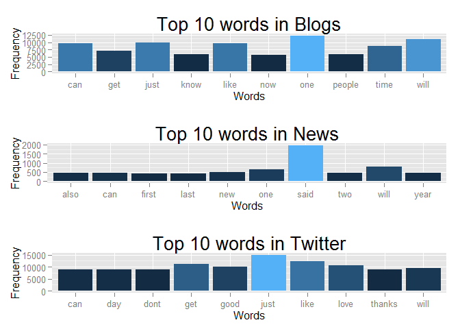
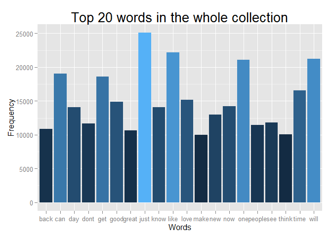
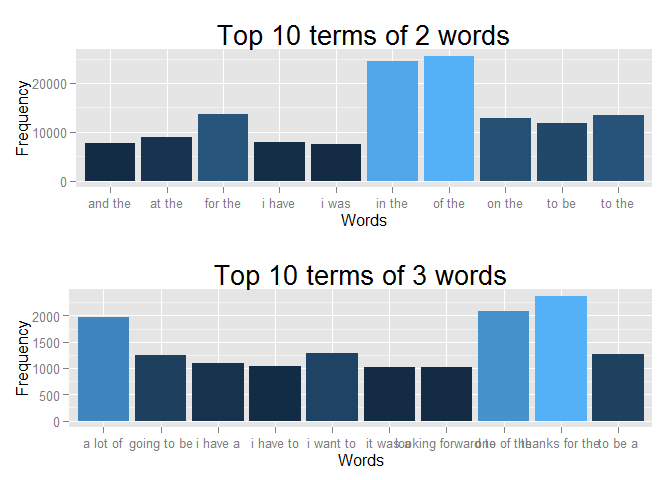
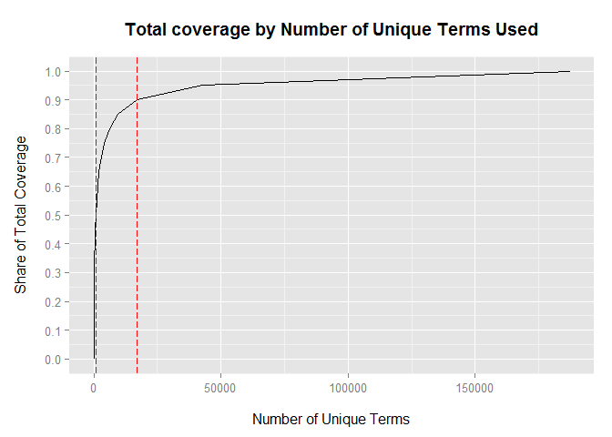

# Milestone Report - Capstone Project
Duy Bui  
July 21st, 2015  
# Synopsis 
The report was completed as an assignment of Capstone Project, Data scientist specialisation, provided by Johns Hopkins University. It is indicative of general understanding of the [SwiftKey data], as well as initial preparation before the project. In particular, the data set is analysed to gain insights into word frequency and distribution throughout each document and the whole collection. 

# 1. Understand data
First of all, we load the necessary libraries for the text mining purpose

```r
library(tm) # text mining
library(RWeka)
library(LaF) # sampling
library(ggplot2)
library(gridExtra)
```


We load the three documents into one corpus and have a quick summmary on the data


```r
full_corpus <- Corpus(DirSource("final/en_US/"), readerControl = list(language="lat"))

# Take a summary to view three files inside the corpus
summary(full_corpus)
```

```
##                   Length Class             Mode
## en_US.blogs.txt   2      PlainTextDocument list
## en_US.news.txt    2      PlainTextDocument list
## en_US.twitter.txt 2      PlainTextDocument list
```

```r
# Get number of lines per document
getCorpusSize <- function(corpus){
  
  size <- as.data.frame(sapply(corpus, function(x) length(x$content)))
  names(size) <- "length"
  return(size)
}

size <- getCorpusSize(full_corpus)
size
```

```
##                    length
## en_US.blogs.txt    899288
## en_US.news.txt      77259
## en_US.twitter.txt 2360148
```

```r
# Get number of characters per document
# 1. en_US.blogs.txt
# 2. en_US.news.txt
# 3. en_US.twitter.txt
inspect(full_corpus)
```

```
## <<VCorpus>>
## Metadata:  corpus specific: 0, document level (indexed): 0
## Content:  documents: 3
## 
## [[1]]
## <<PlainTextDocument>>
## Metadata:  7
## Content:  chars: 208361438
## 
## [[2]]
## <<PlainTextDocument>>
## Metadata:  7
## Content:  chars: 15683765
## 
## [[3]]
## <<PlainTextDocument>>
## Metadata:  7
## Content:  chars: 162384825
```

```r
# Remove it as we will only use a small sample for the analysis purpose
rm(full_corpus)
gc() # garbage collector
```

# 2. Data loading
From the first part, we are aware that the three data files are very big:
- blogs: 899,288 lines
- news:  77,259 lines
- twitter: 2,360,148 lines

Therefore, in the scope of the project, it is quite effective if we could pick a random sample, which is representable and adequately informational for the whole population. Assuming the margin of error is +/-5%, confidence level is 95%, we found the required smallest set size of blogs, news and twitter as 384, 385 and 385 respectively. Therefore, 10% of each data set is sufficient to  represent the population. In fact, 10% of the population (for each data set) could result in only around 0.40% margin of error with confidence level of 99%. It is noted that as the research focuses on text mining, we will not go in depth into probability and statistics formula to calculate sample size. All calculations could be easily made via [checkmarket] website.


```r
# Sampling with sample size as the percentage of the populcation 
generateSample <- function(percent, inFile, outFile, size){
  
  set.seed(3223)
  sample = sample_lines(inFile, n = size*percent)
  write.csv(sample, outFile, row.names = FALSE, col.names = FALSE)
}
```

We create a corpus with sample size proporation of 10% for each txt and for the collection of all data as follows:


```r
# file input directory
in_names <- c("en_US.blogs.txt", "en_US.news.txt", "en_US.twitter.txt")
endir <- paste(getwd(), "final/en_US", sep = "/")
infiledir <- as.vector(sapply(in_names, function(x) paste(endir, x, sep = "/")))

# sample directory
smpdir <- paste(getwd(), "sample", sep="/")
out_names  <- c("blogs.csv", "news.csv", "twitter.csv")
outfiledir <- as.vector(sapply(out_names, function(x) paste(smpdir, x, sep = "/")))

# Create sampled corpus for each txt
for(i in 1:3) generateSample(.10, infiledir[i], outfiledir[i], size[i,])
myCorpus <- Corpus(DirSource(smpdir), readerControl = list(language = "en_US"))

# Remove unused variables
rm(i, in_names, endir, infiledir, smpdir, out_names, outfiledir, size)
# A quick look on the sampled corpus
summary(myCorpus)
```

```
##             Length Class             Mode
## blogs.csv   2      PlainTextDocument list
## news.csv    2      PlainTextDocument list
## twitter.csv 2      PlainTextDocument list
```

# 3. Data cleaning
Pre-processing is crucial in any data anayltics task, and text mining is not an exception. Indeed, data collected from sources such as social networks where bad and quick writing is prevalant would easily contain unformatted text. The following cleaning process includes:
- Transform special characters (such as "/", "@", "\\") into a space
- Remove any punctuation
- Remove numbers
- Convert all text to lower case
- Strip down white space
- Remove profanity words

It is noted that for the profanity words, we collect them from two sources: 
- [Shutter Stock]: an user from github who collects all the dirty, naughty, obscense and otherwise bad words
- [Google project]: a project from google to find all the bad words ("What do we love" project) 

There was a discussion of the necessity of stop words removal and word stemming on forum. Though still being controversial, it was likely that the those two techniques are more useful for semantic analysis, rather than modelling and prediction. Since our task is to create a program for word prediction, stemming and stop words removal might result in a weak model at the end. Therefore, we don't perform these two techniques in this milestones report.  However, for the purpose of finding frequency of words in the document, it might be more effective if stop words removal technique is exclusively used.   


```r
cleanCorpus <- function(corpus){
  
  # Transform any special characters into space
  toSpace <- content_transformer(function(x, pattern) gsub(pattern, " ", x)) 
  corpus.tmp <- tm_map(corpus, toSpace, "/|@|\\|")
  
  # Remove punctuation
  corpus.tmp <- tm_map(corpus.tmp, removePunctuation)
  
  # Remove number
  corpus.tmp <- tm_map(corpus.tmp, removeNumbers)
  
  # Transform to lower case
  corpus.tmp <- tm_map(corpus.tmp, content_transformer(tolower))
  
  # Strip whitespace
  corpus.tmp <- tm_map(corpus.tmp, stripWhitespace)
  
  # Remove profanity words
  profanity1 <- read.csv("badwords.txt", stringsAsFactors = FALSE, header = FALSE)
  profanity2 <- read.csv("ggbadwords.txt", stringsAsFactors = FALSE, header = FALSE)
  profanity <- rbind(profanity1, profanity2) #Combine the two lists
  corpus.tmp <- tm_map(corpus.tmp, removeWords, profanity$V1)
  
  return(corpus.tmp)
}

# Call the function to clean each corpus
myCorpus <- cleanCorpus(myCorpus)

# Remove any stop words in English and create a temporary corpus for the exploratory analysis only.
corpus.tmp <- tm_map(myCorpus, removeWords, stopwords("english"))
```

# 4. Term frequency
Next, it is necessary to find the most frequent words in each document and in the collection of three. "DocumentTermMatrix" method will be used for this purpose. Temporary corpus, which was generated in the previous step, is  


```r
# Generate document term matrix from a corpus
generateDTM <- function(corpus){
  
  dtm <- DocumentTermMatrix(corpus)
  dtm <- removeSparseTerms(dtm, 0.9)
  return(dtm)
}

# Generate frequency of words for each document term matrix, wordNum is number of words to be generated
generateFreq <- function(dtm, wordNum){
  
  freq <- colSums(as.matrix(dtm))
  ord <- order(freq)
  freq <- as.data.frame(freq[tail(ord, wordNum)])
  names(freq) <- "frequency"
  freq$words <- rownames(freq)
  return(freq)
}
```


```r
# Get the frequency for 3 documents
dtm = generateDTM(corpus.tmp)

# list_freqs contain the frequency list of 3 documents
list_freqs <- lapply(dtm$dimnames$Docs, 
              function(i) generateFreq(dtm[dtm$dimnames$Docs == i, ], 10))
```

A bar plot for each document is created. The most frequent word in the three documents:
- blogs: *one*
- news: *said*
- twitter: *just*

 

Similarly, a bar plot is created to explore the top 20 words in the three documents. Words such as *"just", "like", "one", "will"* are most prevalent on internet. 


```r
# Find the frequency for the whole collection
full_freq <- generateFreq(dtm, 20)
createPlot(full_freq, "Top 20 words in the whole collection")
```

 

```r
# Remove unused variables
rm(full_freq, corpus.tmp, list_freqs, p1, p2, p3)
gc() # garbage collector
```

# 5. Tokenization
Since the project is about word prediction where  word/group of words is predicted after certain words are in-putted, it is necessary to understand the frequency of word groups in all three documents. Tokenization and TermDocumentMatrix() are used to find the n-gram word group (n is the number of words in a group).  

```r
findnGram <- function(corpus, ngram, wordNum){
  
  # Create Term Document Matrix with tokenization
  options(mc.cores=1)
  gramTokenizer <- function(x) NGramTokenizer(x,Weka_control(min=ngram,max=ngram))
  tdm <- TermDocumentMatrix(corpus, control = list(tokenize = gramTokenizer))
  
  # Sum the count of each term
  nGram<-rowSums(as.matrix(tdm))
  
  # Create a data frame with "wordNum" of most frequent terms
  freq <- as.data.frame(tail(sort(nGram), wordNum))
  names(freq) <- "frequency"
  freq$words <- rownames(freq)
  return(freq)
}

# 2-gram words
biGram <-  findnGram(myCorpus, 2, 10)
# 3-gram words
triGram <- findnGram(myCorpus, 3, 10)

# Create a bar plot for n-gram
p1 <- createPlot(biGram, "Top 10 terms of 2 words")
p2 <- createPlot(triGram, "Top 10 terms of 3 words")
grid.arrange(p1, p2, ncol=1, nrow = 2)
```

 

```r
# Remove unused variables
rm(p1, p2, biGram, triGram)
```

The exploratory analysis shows that *"in the"* and *"of the"* are the two most 2-gram terms in the documents; while *"one of the"*, *"thanks for the"* and *"a lot of"* are more prevalent in the 3-gram terms world. 

# 6. Unique Words
Assuming that the sample . In order to find the number of words which could cover a percentage of the dictionary, We use this to find number of unique words needed to cover 50%, 90% of all words instance

```r
# Generate the frequency of one-gram words (from DocumentTermMatrix)
freq <- colSums(as.matrix(dtm))
freq <- sort(freq, decreasing = TRUE)
uniqueWords <- function(freqVector, prob){
  
  num = 0
  totalWords = sum(freqVector)
  while(sum(freqVector[1:num])/totalWords < prob) num = num + 1    
  return(num)
}

coverage <- data.frame(rate = seq(0, 1, 0.05), wordNum = sapply(seq(0, 1, 0.05), function(x) uniqueWords(freq, x)))

# Number of unique words to cover 50%
coverage[coverage$rate == 0.5,"wordNum"]
```

```
## [1] 831
```

```r
# Number of unique words to cover 90%
coverage[coverage$rate == 0.9,"wordNum"]
```

```
## [1] 16977
```

```r
ggplot(coverage, aes(wordNum, rate)) + 
  geom_line() + 
  scale_y_continuous(breaks = seq(0, 1, 0.1)) +
  geom_vline(xintercept = 831, col = 'red', linetype = 5) + 
  geom_vline(xintercept = 16977, col = 'red', linetype = 'longdash') + 
  ggtitle('Total coverage by Number of Unique Terms Used\n') + 
  theme(plot.title = element_text(lineheight = .8, face = 'bold')) + 
  labs(x = '\nNumber of Unique Terms', y = 'Share of Total Coverage\n')
```

 

The coverage figure shows that it is quick to reach to the high coverage of 90%, which however it then rises more slowly towards to the 100%

To increase the coverage, we either reduce quantity of words in the whole dictionary or increase the number of words with high frequency. First of all, stemming technique could reduce the number of word observations by removing prefix and suffix of English words. Also, since stop words usually have higher frequency than normal words, it might rise the coverage if they are kept in the dictionary.  

# Summary
The report is an initial step into the text mining world. It contains some starting techniques to understand corpus of text and retrieve great ininital insights into it. 

However, the objective of the project is more about prediction on text data, which requires more techniques on text mining. My plan is to use Amazon Webservice for the prediction app as it is more robust in dealing with big data. Working on one computer could take a few minutes/hours to make one prediction, which sounds unpractical for the Swift key application. 

[SwiftKey data]:https://d396qusza40orc.cloudfront.net/dsscapstone/dataset/Coursera-SwiftKey.zip
[checkmarket]:https://www.checkmarket.com/market-research-resources/sample-size-calculator/
[Shutter Stock]: https://github.com/shutterstock/List-of-Dirty-Naughty-Obscene-and-Otherwise-Bad-Words/blob/master/en
[Google project]: https://gist.github.com/jamiew/1112488
